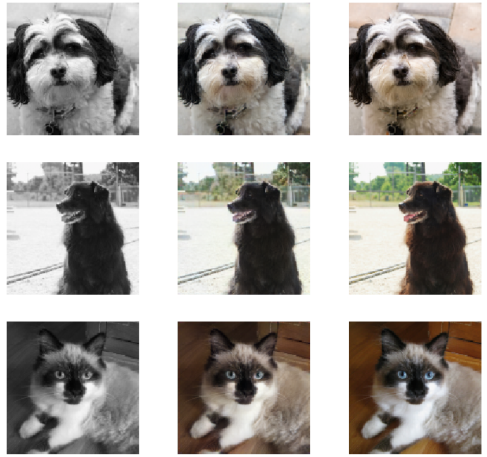

# Awesome Hacktoberfest 

> [Hacktoberfest](https://hacktoberfest.digitalocean.com/) is a chance to level up your coding skills and get small goodies in reward.

<br />
<p align="center">
  <a href="https://hacktoberfest.digitalocean.com/">
    
  </a>
</p>

## Official website for registration and tips on how to get started

- [Hacktoberfest Official Website](https://hacktoberfest.digitalocean.com/)
- [Hacktoberfest Tutorial](https://youtu.be/0mjJS1Y8wrI) - Introduction to Hacktoberfest
- [Hacktoberfest Swag List](https://benbarth.github.io/hacktoberfest-swag/) - List of all goodies given away by companies

<h1>Colorization using GANs and UNet</h1>
<p>In this project grayscale images are converted to colored images.
  
The dataset used in this project is the Oxford-IIIT pets dataset.</p><br>
<h5>Notebooks don't render properly, clone the repo to view the code. :-)</h5><br>
<h3 align = "center">Grayscale || Generated || Original</h3>


## Built With

* [UNET](https://towardsdatascience.com/unet-line-by-line-explanation-9b191c76baf5)
* [GANs](https://en.wikipedia.org/wiki/Generative_adversarial_network)

 ## Contributing

Contributions are what make the open source community such an amazing place to be learn, inspire, and create. Any contributions you make are **greatly appreciated**.

1. Fork the Project
2. Create your Feature Branch 
```md
   git checkout -b feature/AmazingFeature
```
3. Commit your Changes 
```md
   git commit -m 'Add some AmazingFeature'
```
4. Push to the Branch
```md
   git push origin feature/AmazingFeature
``` 
5. Open a Pull Request
